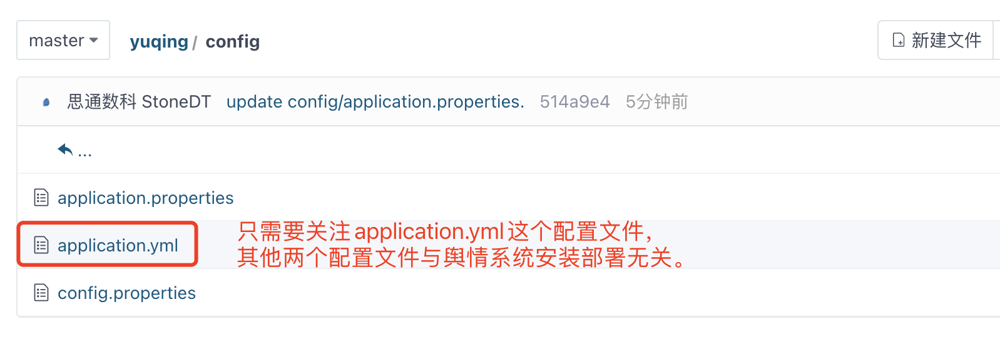

# 思通舆情安装配置手册

## 操作系统选择
我们推荐您使用 Linux Ubuntu 16 或 Ubuntu 18的版本。

Window 系统也可以使用，但我们并不推荐，

因为本手册最要针对 Linux 及 Ubuntu 安装配置过程说明指引。

## 安装java环境

我们推荐您使用 Java JDK8版本

JDK8 Oracle官方下载地址：[https://www.oracle.com/java/technologies/downloads/#java8
](https://www.oracle.com/java/technologies/downloads/#java8)

window安装JDK8 参见：
https://www.cnblogs.com/zhangzhixing/p/12953187.html

Linux安装JDK8 参见：
https://www.jianshu.com/p/75f0f34b599d

## 安装MySQL数据库

### 软件安装
Ubuntu apt-get 安装 参见：

https://blog.csdn.net/weixx3/article/details/80782479

Ubuntu 源码 安装 参见：

https://www.cnblogs.com/weijing24/p/4948880.html

### 配置远程权限
MySQL 5.5 和 MySQL 8.0配置MySQL连接权限的 **_方式不一样_** ，分别为：

MySQL 5.5+

> GRANT ALL PRIVILEGES ON . TO ‘root’@’%’ IDENTIFIED BY ‘123456’ WITH GRANT OPTION;
> 
> flush privileges;

MySQL 8.0+

> create user 'root'@'%' identified by '密码';
> 
> alter user 'root'@'%' identified by '新密码';
> 
> grant all privileges on *.* to 'root'@'%' with grant option;
> 
> flush privileges;

参见：

https://blog.csdn.net/weixin_43431593/article/details/106872836

https://www.cnblogs.com/gychomie/p/11013442.html

### 数据导入
我们使用了 [Flyway](https://flywaydb.org/) 数据库迁移工具。简单点说，就是在你部署应用的时候，帮你执行数据库脚本的工具。Flyway支持SQL和Java两种类型的脚本，你可以将脚本打包到应用程序中，在应用程序启动时，由Flyway来管理这些脚本的执行，帮你自动执行系统需要初始化的数据库的建表语句以及数据库脚本。

## 安装Redis

源码及apt安装

http://www.imxmx.com/Item/1/211097.html

## 配置文件

说明配置文件，以及配置文件中几个关键点的含义

## 下载程序

下载地址

程序目录

## 启动程序
启动在后台

启动在前台

## 常见问题

## MySQL数据库连接
## 热点资讯没有数据