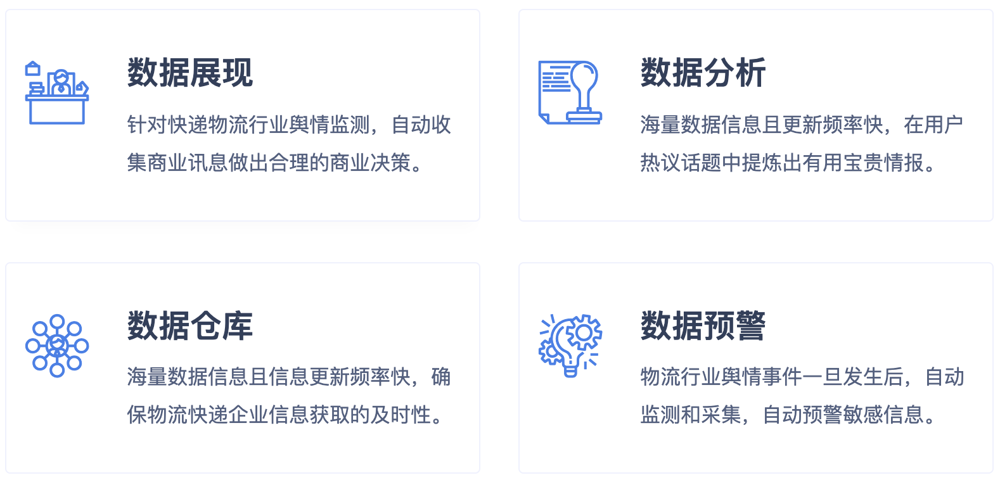

## 客户背景
中国的邮政系统经过几十年的建设，几乎可以到达国内任何一个角落。下设6.7万多个局所， 有覆盖全国城乡的运输、配送网络和201个邮件处理物流中心。

## 客户需求
对管辖范围发生在互联网上的负面信息、突发性事件， 将第一时间通过邮件、客户端、短信、微信、PC弹窗等多达5种方式， 向相关负责人下发预警信息，提示其第一时间介入处理。

## 建设方案
通过对全网邮政、快递行业的洞察，客户可以实时了解到特别全面的行业信息，对于集团制定市场策略提供了很大帮助。 帮助政府邮政部门对辖区内或者某个领域里，媒体、民众在互联网上发布相关信息进行采集。 并按照设定的标准呈现出来，比如只展示敏感信息、优先展示相似信息数多的信息等等。

## 方案价值
快递物流行业的快速发展，涉及快递物流行业的事件也在不断突发。为有效预防快递物流舆情事件的突发， 就亟需加强快递物流行业舆情监测，从全面、实时、多视角的统计与分析。 让用户时刻洞察、处处明晰。基于可视化分析技术，以出色而智能的方式，让每一次舆情预警都能更智能、更快速。 及时提早发现网民在网络上暴露的舆情危机事件，例如：送货速度慢、服务态度差、物流信息更新慢等印象。

- 同时系统帮助邮政系统实时监测负面舆论。

- 在品牌监测、营销效果跟踪等方面，帮助客户及时知晓自身的网络声音。

- 能让其本身能够及时处理危机事件，有效的控制了事件的传播和发展。

- 同时作为国家邮政行业监管部门，还能对整个快递行业也起到了市场监督与规范化的作用。

